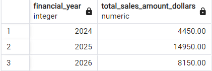

## Setup Notes

This repo uses Dockerised instances of Postgres and dbt Core to deploy a star schema model using raw csv files. [Docker Desktop](https://www.docker.com/products/docker-desktop/) is required to deploy this project in your own local environment. To recreate this project:
* Clone this repository
* Run `docker compose up -d`
* Query the data in pgadmin on _localhost:9090_, with username `admin@admin.com` and password `admin`

## ETL Summary

Raw files are loaded to a "raw" schema `postgres.raw` via [dbt seeds](https://docs.getdbt.com/reference/commands/seed). This is then passed to a "staging" schema `postgres.stage` where light transformation tasks such as deduplication, renaming, data typing, and null handling take place. Staged models are then used to directly create the facts, dimensions, and bridge table in a "modelling" schema `postgres.model`. No intermediate models and schemas are required between staging and modeling in this particular case study.

Definitions for raw, staged, and modelled data can be found in the `seeds`, `models/stage`, `models/model` folders respectively. On `dbt run` these models are created as tables in the postgres database using DDL similar to a CTAS operation.

## Data Modelling Notes

This case study attempts to create a simple star schema model based on randomly-generated, normalised sales data. The modelling exercise appears to be straight forward with the exception of the following observations:
### Many-to-many relationship between sales and products ###
There appear to be no clear relationships or patterns to allow us to infer number of units of each product sold in each bundle for each sale. If this was actual sales data, the wide variability between total sales amount and the total unit cost of products in each product bundle suggest there are other factors at play, possibly requiring a weighting factor to be applied to each product in the bridge. Additional information from point of sales systems is likely required (e.g. units sold per bundle, currency units, additional discounts applied) to better understand the sales performance of individual products.
### One-to-one or many-to-one relationship between promotions and product bundles ###
Based on observation of the raw data, this model assumes that the timeframes of each unique promotion never overlap with each other. If the possibility of overlap exists between promotions, then this would likely need to be modelled using a time-varying bridge table, e.g. with multiple promotions tied to a promotion group with effective from and to dates. The assumption of a one-to-one of many-to-one relationship allows us to directly relate the promotion dimension to the fact table based on the validity period of the promotion and the product bundle that it applies to.
### Slowly changing dimensions ###
This model does not include time-variant dimensional attributes, therefore no SCD techniques are applied. One thing to note is that customer age and customer location would likely be better served as type 4 SCDs (customer demographics & customer delivery/residential address dimensions) but have been kept in the customer dimension in this model for simplicity. Customer DOB (as opposed to age) would be a better candidate for the customer dimension.
### Surrogate keys ###
Surrogate keys have been created using the `dbt_utils.generate_surrogate_keys` function (MD5 function with null handling). However, due to the point above, there is no real need for this model to use surrogate keys. An alternative would be to retain the integer ID as the natural key and create placeholder dimension rows for null/missing/"not applicable" attributes using negative integer IDs.

## Analysis Notes

The multivalued product dimension makes it difficult to analyse sales amounts by product without further information supplied about the units sold in each product bundle, as the provided price and discount attributes do not match up to the total sales amount of each sale.

However, to answer high-level questions like "What was the total revenue for sales in each FY where an Electronics product was part of the product bundle" we might construct a query as below:
```
with flattened as (
	select
		fct_sales.order_date,
		fct_sales.order_id,
		dim_date.financial_year,
		fct_sales.sales_amount_dollars,
		dim_bundled_product.bundled_product_name,
		string_agg(product_category, ',' order by product_category) as bundled_product_categories
	from model.fct_sales
	inner join model.dim_bundled_product
		on fct_sales.bundled_product_key = dim_bundled_product.bundled_product_key
	inner join model.bdg_bundled_product_product
		on dim_bundled_product.bundled_product_key = bdg_bundled_product_product.bundled_product_key
	inner join model.dim_product
		on bdg_bundled_product_product.product_key = dim_product.product_key
	inner join model.dim_date
		on fct_sales.order_date = dim_date.date
	group by 1,2,3,4,5
	order by 1
)

select
	financial_year,
	sum(sales_amount_dollars) as total_sales_amount_dollars
from flattened
where 1=1
	and bundled_product_categories like '%Electronics%'
group by 1
order by 1;
```



There appears to be very few sales that occured under promotional circumstances. As a result of this and a small sample size, we cannot draw any meaningful insights on the effects of each promotion on sales.
